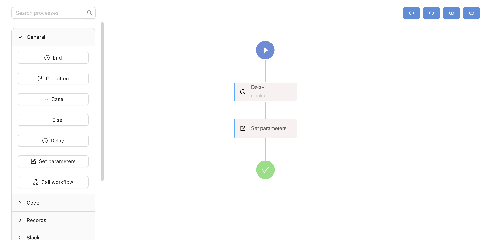

# Adminix designer for React.js



## About Adminix

Adminix is a serverless workflow automation platform. It connects to your AWS account and configures automated workflows using serverless functionality. It is also an embeddable solution that you can integrate into your web application, giving it workflow automation capabilities. Please read more on our [website](https://www.adminix.io).

## Requirements

The minimum supported version of React is v16.8. If you use an older version,
upgrade React to use this library.

## Getting started

### Minimal example

1. First, you need to [sign up](https://app-eu.adminix.io/sign-up). or [login](https://app-eu.adminix.io/login). to Adminix. After that go to [the profile page](https://app-eu.adminix.io/profile/edit), go to developer tab and generate an access token.

2. Install adminix-designer-react

  ```sh
  npm install --save adminix-designer-react
    
  or 
    
  yarn add adminix-designer-react
  ```

3. Generate a temporary access token inside your back-end.

  ```js
import axios from 'axios';

// inside your back-end call this function and return temporary access token
const generateTemporaryAccessToken = ({ workflowId }) => {
  const url = `https://api-eu.adminix.io/api/v1/workflows/${workflowId}/generate_embeddable_link`;
  const response = await axios.post(url, {
    headers: {
      Authorization: `Bearer ${process.env.ADMINIX_ACCESS_TOKEN}`,
    },
  });
      
  return response.data.token;
};

export default generateTemporaryAccessToken;
  ```

4. Then import the component and start using it.

```jsx
import { useCallback } from 'react';
import WorkflowDesigner, { useWorkflow } from 'adminix-designer-react';

// Please make sure that you fetched token and you have workflowId
const ExampleComponent = ({ token, workflowId }) => {
  const workflow = useWorkflow({ token, workflowId });
  
  const onSaveClick = useCallback(() => {
    workflow.save();
  }, [workflow]);

  const onDeployClick = useCallback(() => {
    workflow.deploy();
  }, [workflow]);

  const onSave = useCallback(() => {
    alert('onSave callback');
  }, []);

  const onDeploy = useCallback(() => {
    alert('onDeploy callback');
  }, []);

  const onDeploying = useCallback(() => {
    alert('onDeploying callback');
  }, []);
  
  const onChanged = useCallback(() => {
    console.log('onChanged callback');
  }, []);

  return (
    <WorkflowDesigner
      workflow={workflow}
      width="100%"
      height="500px"
      onSave={onSave}
      onDeploy={onDeploy}
      onDeploying={onDeploying}
      onChanged={onChanged}
      colorPrimary="#568CDC"
      fontSize="14"
      disableMessages={false}
      disableActions={false}
    />
  );
};

export default ExampleComponent;
```
